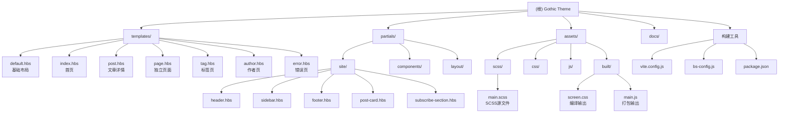
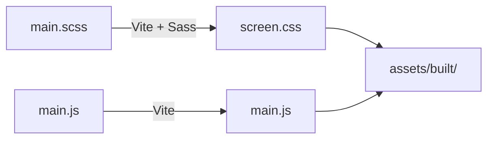

# Gothic - Ghost CMS 哥特风格主题

> **项目类型**: Ghost CMS Theme
> **版本**: 2.0.0
> **Ghost 引擎**: >=5.0.0
> **最后扫描**: 2026-03-08 16:48:37

---

## 变更记录 (Changelog)

| 日期 | 版本 | 变更内容 |
|------|------|----------|
| 2026-03-08 | 2.0.1 | 初始化AI上下文，更新项目文档结构，添加 Vite 构建链 |
| 2026-03-08 | 2.0.0 | 添加构建工具链（Vite + SCSS + BrowserSync） |
| 2026-03-08 | 1.0.0 | 初始文档生成 - 完整扫描项目结构 |

---

## 项目愿景

Gothic 是一个为 Ghost 博客平台设计的**暗黑哥特风格主题**，融合了中世纪美学与现代 Web 设计规范。主题以深色系为主调，搭配暗红色强调色与米色文字，营造出神秘、优雅的阅读氛围。

### 设计规范

| 元素 | 规范值 |
|------|--------|
| 主背景色 | #0a0a0a, #0d0d0d, #080808 |
| 强调色 | #8B0000 (暗红色) |
| 主文字色 | #F5F0E8, #F2EBDC (米色) |
| 次要色 | #8E82A7, #A99FC2, #C6C0D5 (紫色系) |
| 标题字体 | Cormorant Garamond, Cinzel |
| 正文字体 | Manrope, Cormorant Garamond |

---

## 架构总览



---

## 模块索引

| 模块 | 路径 | 职责描述 | 入口文件 |
|------|------|----------|----------|
| 模板层 | `/` | Handlebars 页面模板 | `default.hbs`, `index.hbs`, `post.hbs` |
| Site Partials | `/partials/site/` | 站点级可复用组件 | `header.hbs`, `sidebar.hbs`, `footer.hbs` |
| 功能组件 | `/partials/components/` | 通用UI组件 | `post-card.hbs`, `search-overlay.hbs` |
| 布局组件 | `/partials/layout/` | 页面布局组件 | `head.hbs`, `header.hbs`, `footer.hbs` |
| SCSS 架构 | `/assets/scss/` | 主样式源文件 | `main.scss` |
| CSS 基础 | `/assets/css/base/` | 基础样式层 | `variables.css`, `reset.css` |
| CSS 布局 | `/assets/css/layout/` | 布局样式层 | `container.css`, `grid.css` |
| CSS 组件 | `/assets/css/components/` | 组件样式层 | `nav.css`, `card.css`, `hero.css` |
| JS 架构 | `/assets/js/` | JavaScript 主入口 | `main.js` |
| JS 核心 | `/assets/js/core/` | 核心工具 | `constants.js`, `utils.js` |
| JS 模块 | `/assets/js/modules/` | 功能模块 | `navigation.js`, `search.js`, `animation.js` |
| 项目文档 | `/docs/` | 设计文档 | `architecture.md`, `tech-spec.md` |

---

## 运行与开发

### 开发环境设置

```bash
# 安装依赖
npm install

# 开发模式（构建 + 热重载）
npm run dev

# 仅构建（开发模式）
npm run dev:build

# 仅启动 BrowserSync
npm run dev:serve

# 生产构建
npm run build

# 打包主题
npm run zip

# 清理构建输出
npm run clean
```

### 构建流程



### 文件结构

```
gothic/
├── assets/
│   ├── scss/
│   │   └── main.scss          # SCSS 主入口
│   ├── css/                   # 基础 CSS 文件
│   │   ├── base/
│   │   ├── layout/
│   │   └── components/
│   ├── js/
│   │   ├── main.js            # JS 主入口
│   │   ├── core/              # 核心工具
│   │   └── modules/           # 功能模块
│   └── built/                 # 构建输出
│       ├── screen.css
│       └── main.js
├── partials/
│   ├── site/                  # 站点级组件
│   ├── components/            # 通用组件
│   └── layout/                # 布局组件
├── *.hbs                      # 页面模板
├── package.json               # Ghost 主题配置
├── vite.config.js             # Vite 配置
├── bs-config.js               # BrowserSync 配置
└── docs/                      # 项目文档
```

---

## 测试策略

### Ghost 功能测试清单

- [ ] 页面加载测试
- [ ] 响应式布局测试 (320px - 2560px)
- [ ] 跨浏览器测试 (Chrome, Firefox, Safari, Edge)
- [ ] 无障碍测试 (键盘导航、屏幕阅读器)
- [ ] 性能测试 (Lighthouse)
- [ ] Ghost 功能测试
  - [ ] 文章列表显示
  - [ ] 文章详情页
  - [ ] 标签/分类页面
  - [ ] 作者页面
  - [ ] 分页功能
  - [ ] 搜索功能
  - [ ] 会员内容
  - [ ] Newsletter

---

## 编码规范

### Handlebars 模板规范

- 使用语义化标签（`<header>`, `<main>`, `<footer>`）
- 使用 `{{t}}` 助手进行国际化
- 使用 `{{img_url}}` 助手处理图片

### CSS/SCSS 规范

- 使用 CSS 变量定义设计系统
- SCSS 嵌套层级不超过 3 层
- BEM-like 命名约定

### JavaScript 规范

- ES6+ 语法
- 模块化导入导出
- 使用 `debounce`/`throttle` 优化性能

---

## AI 使用指引

### 关键文件速查

| 需求 | 查看文件 |
|------|----------|
| 了解主题配置 | `package.json` |
| 修改颜色主题 | `assets/scss/main.scss` 或 `assets/css/base/variables.css` |
| 修改页面布局 | `default.hbs`, `partials/site/*.hbs` |
| 添加 JS 功能 | `assets/js/modules/` |
| 修改组件样式 | `assets/scss/main.scss` |
| 修改模板组件 | `partials/site/*.hbs` |

### 常用常量

- **断点**: 980px (移动端切换点)
- **侧边栏宽度**: 360px
- **主容器最大宽度**: 1200px

---

## 相关文件清单

### 核心模板文件
- `/default.hbs` - 基础布局模板
- `/index.hbs` - 首页模板
- `/post.hbs` - 文章详情页
- `/page.hbs` - 独立页面模板
- `/tag.hbs` - 标签归档页
- `/author.hbs` - 作者页
- `/error.hbs` - 错误页

### Partials
- `/partials/site/header.hbs` - 站点头部
- `/partials/site/sidebar.hbs` - 侧边栏
- `/partials/site/footer.hbs` - 站点底部
- `/partials/site/post-card.hbs` - 文章卡片
- `/partials/site/subscribe-section.hbs` - 订阅区块

### 配置与文档
- `/package.json` - Ghost 主题配置
- `/vite.config.js` - Vite 构建配置
- `/bs-config.js` - BrowserSync 配置
- `/docs/architecture.md` - 架构设计文档
- `/docs/tech-spec.md` - 技术规范文档

---

*文档生成时间: 2026-03-08 16:48:37*
