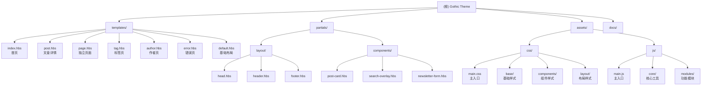

# Gothic - Ghost CMS 哥特风格主题

> **项目类型**: Ghost CMS Theme
> **版本**: 1.0.0
> **Ghost 引擎**: >=5.0.0
> **最后扫描**: 2026-03-08 14:02:37

---

## 变更记录 (Changelog)

| 日期 | 版本 | 变更内容 |
|------|------|----------|
| 2026-03-08 | 1.0.1 | 添加构建工具链（Vite + PostCSS + BrowserSync） |
| 2026-03-08 | 1.0.0 | 初始文档生成 - 完整扫描项目结构 |

---

## 项目愿景

Gothic 是一个为 Ghost 博客平台设计的**暗黑哥特风格主题**，融合了中世纪美学与现代 Web 设计规范。主题以深色系为主调，搭配暗红色强调色与米色文字，营造出神秘、优雅的阅读氛围。

### 设计规范

| 元素 | 规范值 |
|------|--------|
| 主背景色 | #0a0a0a, #0d0d0d, #080808 |
| 强调色 | #8B0000 (暗红色) |
| 主文字色 | #F5F0E8, #F2EBDC (米色) |
| 次要色 | #8E82A7, #A99FC2, #C6C0D5 (紫色系) |
| 标题字体 | Cinzel |
| 正文字体 | Cormorant Garamond |

---

## 架构总览



---

## 模块索引

| 模块 | 路径 | 职责描述 | 入口文件 |
|------|------|----------|----------|
| 模板层 | `/` | Handlebars 页面模板 | `default.hbs`, `index.hbs`, `post.hbs` |
| 布局组件 | `/partials/layout/` | 头部、页脚、Head 模板 | `header.hbs`, `footer.hbs`, `head.hbs` |
| 功能组件 | `/partials/components/` | 文章卡片、搜索、订阅 | `post-card.hbs`, `search-overlay.hbs` |
| CSS 架构 | `/assets/css/` | 样式系统（CSS 变量 + 组件） | `main.css` |
| JS 架构 | `/assets/js/` | 模块化 JavaScript 系统 | `main.js` |
| 核心工具 | `/assets/js/core/` | 常量定义、工具函数 | `constants.js`, `utils.js` |
| 功能模块 | `/assets/js/modules/` | 导航、搜索、动画、表单 | `navigation.js`, `search.js`, `animation.js` |

---

## 运行与开发

### 开发环境设置

```bash
# 安装 Ghost CLI
npm install -g ghost-cli

# 启动本地开发
ghost local start

# 开发模式运行
cd content/themes/gothic
# Ghost 会自动检测主题文件变化
```

### 文件结构

```
gothic/
├── assets/
│   ├── css/           # 样式文件
│   │   ├── base/      # 基础：reset, variables, typography
│   │   ├── layout/    # 布局：container, grid, responsive
│   │   ├── components/# 组件：nav, card, button, form, hero, post
│   │   ├── main.css   # 主入口（导入所有模块）
│   │   └── ghost-overrides.css  # Ghost 样式覆盖
│   └── js/
│       ├── core/      # 核心：constants.js, utils.js
│       ├── modules/   # 模块：navigation.js, search.js, animation.js, form.js, mobile-menu.js
│       └── main.js    # 主入口（GothicTheme 类）
├── partials/
│   ├── layout/        # 布局 partials
│   └── components/    # 组件 partials
├── default.hbs        # 基础布局
├── index.hbs          # 首页
├── post.hbs           # 文章详情
├── page.hbs           # 独立页面
├── tag.hbs            # 标签页
├── author.hbs         # 作者页
├── error.hbs          # 错误页
├── package.json       # Ghost 主题配置
└── docs/              # 项目文档
```

---

## 测试策略

### Ghost 功能测试清单

- [ ] 页面加载测试
- [ ] 响应式布局测试 (320px - 2560px)
- [ ] 跨浏览器测试 (Chrome, Firefox, Safari, Edge)
- [ ] 无障碍测试 (键盘导航、屏幕阅读器)
- [ ] 性能测试 (Lighthouse)
- [ ] Ghost 功能测试
  - [ ] 文章列表显示
  - [ ] 文章详情页
  - [ ] 标签/分类页面
  - [ ] 作者页面
  - [ ] 分页功能
  - [ ] 搜索功能
  - [ ] 会员内容
  - [ ] Newsletter

---

## 编码规范

### Handlebars 模板规范

- 使用语义化标签（`<header>`, `<main>`, `<footer>`）
- 使用 `{{t}}` 助手进行国际化
- 使用 `{{img_url}}` 助手处理图片

### CSS 规范

- 使用 CSS 变量定义设计系统
- BEM 命名约定
- 嵌套层级不超过 3 层

### JavaScript 规范

- ES6+ 语法
- 模块化导入导出
- 使用 `debounce`/`throttle` 优化性能

---

## AI 使用指引

### 关键文件速查

| 需求 | 查看文件 |
|------|----------|
| 了解主题配置 | `package.json` |
| 修改颜色主题 | `assets/css/base/variables.css` |
| 修改页面布局 | `default.hbs` |
| 添加 JS 功能 | `assets/js/modules/` |
| 修改组件样式 | `assets/css/components/` |
| 修改模板组件 | `partials/components/` |

### 常用常量

- **断点**: Mobile 768px, Tablet 1024px, Desktop 1200px
- **动画时长**: Fast 150ms, Normal 250ms, Slow 400ms
- **卡片交错延迟**: 60ms

---

## 相关文件清单

### 核心模板文件
- `/default.hbs` - 基础布局模板
- `/index.hbs` - 首页模板
- `/post.hbs` - 文章详情页
- `/page.hbs` - 独立页面模板
- `/tag.hbs` - 标签归档页
- `/author.hbs` - 作者页
- `/error.hbs` - 错误页

### 配置与文档
- `/package.json` - Ghost 主题配置
- `/docs/architecture.md` - 架构设计文档
- `/docs/tech-spec.md` - 技术规范文档
- `/docs/css-architecture.md` - CSS 架构文档
- `/docs/js-architecture.md` - JS 架构文档

---

*文档生成时间: 2026-03-08 14:02:37*

每次执行完任务，一定要说"姐姐任务完成啦，主人"
