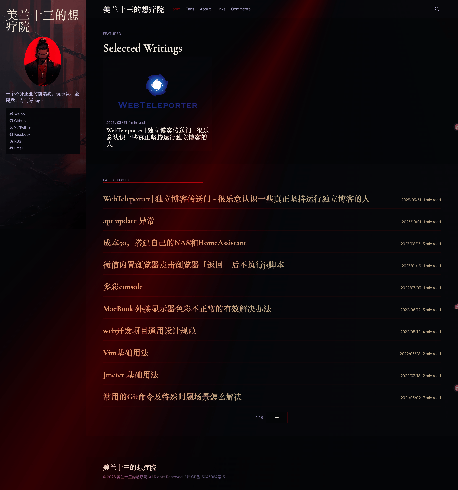
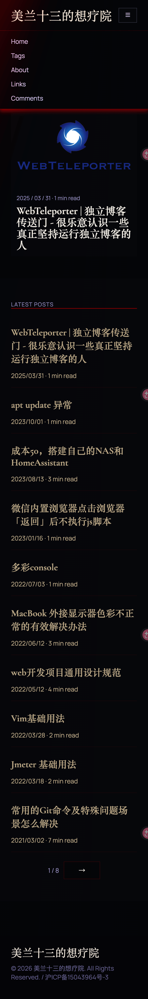

# Luno Gothic

[](https://ghost.org/)
[](https://nodejs.org/)
[](https://pnpm.io/)
[](LICENSE)

一款专为 Ghost CMS 设计的暗黑哥特风格主题，融合中世纪美学与现代 Web 设计规范。

---

## 主题特性

- **暗黑哥特风格** - 深色系配色方案，暗红色强调色，米色文字
- **响应式设计** - 完美适配移动端、平板和桌面设备
- **现代构建工具** - 使用 Vite + SCSS + BrowserSync 构建链
- **完整页面支持** - 首页、文章页、标签页、作者页、独立页面、错误页
- **会员系统支持** - 兼容 Ghost 会员订阅功能
- **搜索功能** - 内置搜索覆盖层
- **评论集成** - 支持 Disqus 评论系统
- **代码高亮** - 本地集成的 highlight.js 语法高亮
- **图标库** - Font Awesome 6 图标支持
- **社交链接** - 社交媒体链接展示
- **打赏功能** - 内置文章打赏弹窗

---

## 设计规范

| 元素 | 规范值 |
|------|--------|
| 主背景色 | `#0a0a0a`, `#0d0d0d` |
| 强调色 | `#8B0000` (暗红色) |
| 主文字色 | `#F5F0E8`, `#F2EBDC` (米色) |
| 次要色 | `#8E82A7`, `#A99FC2` (紫色系) |
| 标题字体 | Cormorant Garamond, Cinzel |
| 正文字体 | Manrope, Cormorant Garamond |

---

## 如何使用

### 安装主题

#### 方法一：通过 Ghost 后台安装（推荐）

1. 下载主题 ZIP 包：
   ```bash
   pnpm install
   pnpm run zip
   ```
2. 登录 Ghost 后台 → Settings → Design → Upload theme
3. 上传生成的 `luno-gothic.zip` 文件

#### 方法二：直接复制

将主题文件夹复制到 Ghost 安装目录的 `content/themes/` 下，然后在后台激活。

### Ghost 后台配置

主题支持丰富的自定义配置，在 Ghost 后台 **Settings → Design → Site wide** 中设置：

#### 个人资料

| 配置项 | 类型 | 说明 | 默认值 |
|--------|------|------|--------|
| `profile_badge` | 文本 | 个人徽章/标签，显示在头像下方 | 空 |
| `profile_role` | 文本 | 角色/职位 | 空 |
| `profile_bio` | 文本 | 个人简介 | 记录设计、阅读与深夜思考。 |

#### 首页 Hero

| 配置项 | 类型 | 说明 | 默认值 |
|--------|------|------|--------|
| `hero_title` | 文本 | 首页大标题 | INTO THE VELVET NIGHT |
| `hero_desc` | 文本 | 首页副标题/描述 | 在暗色中书写故事，在静默中雕刻观点。 |
| `hero_bg` | 图片 | 首页 Hero 背景图片 | 无 |

#### 评论系统

| 配置项 | 类型 | 说明 | 默认值 |
|--------|------|------|--------|
| `shortname_by_disqus` | 文本 | Disqus 短域名，用于启用评论 | 空 |

#### Newsletter 订阅

| 配置项 | 类型 | 说明 | 默认值 |
|--------|------|------|--------|
| `newsletter_title` | 文本 | 订阅区块标题 | Subscribe |
| `newsletter_description` | 文本 | 订阅区块描述 | Get the latest posts delivered right to your inbox. |

#### 打赏功能

| 配置项 | 类型 | 说明 | 默认值 |
|--------|------|------|--------|
| `donate_on` | 布尔 | 是否开启文章打赏功能 | false |
| `donate_text_1` | 文本 | 第一个打赏方式名称 | 支付宝打赏 |
| `donate_img_1` | 图片 | 第一个打赏方式二维码图片 | 无 |
| `donate_text_2` | 文本 | 第二个打赏方式名称 | 微信打赏 |
| `donate_img_2` | 图片 | 第二个打赏方式二维码图片 | 无 |

#### 页脚设置

| 配置项 | 类型 | 说明 | 默认值 |
|--------|------|------|--------|
| `footer_icp` | 文本 | 页脚 ICP 备案号（中国大陆网站需要） | 空 |

### 必需 Ghost 设置

确保 Ghost 后台已配置：

- **Publication info** - 站点标题、描述、语言
- **Publication logo** - 站点 Logo
- **Publication cover** - 站点封面图（推荐深色图片配合主题）
- **Social accounts** - 社交账号链接
- **Navigation** - 主导航菜单

---

## 如何开发

### 环境要求

- Node.js >= 18.0.0
- pnpm >= 10.0.0 （**必须使用 pnpm**，禁止 npm/yarn）
- Ghost >= 5.0.0

### ⚠️ 重要：包管理器约束

本项目强制使用 **pnpm**，`.npmrc` 已配置约束。如尝试使用 npm/yarn 会报错。

```bash
# ✅ 正确
pnpm install

# ❌ 错误 - 会被阻止
npm install
yarn install
```

### 安装依赖

```bash
pnpm install
```

### 开发命令

```bash
# 启动完整开发环境（构建 + 热重载）
pnpm run dev

# 仅启动构建监听
pnpm run dev:build

# 仅启动 BrowserSync 服务器
pnpm run dev:serve
```

开发环境将同时启动：
- **Vite 构建监听** - 监听 SCSS/JS 变化并自动编译
- **BrowserSync** - 提供本地预览和热重载

### 生产构建

```bash
# 构建生产版本
pnpm run build
```

输出文件位于 `assets/built/`：
- `screen.css` - 编译后的样式
- `main.js` - 编译后的脚本

### 打包主题

```bash
# 构建并生成可安装的 ZIP 包
pnpm run zip
```

### 清理构建文件

```bash
pnpm run clean
```

---

## 项目结构

```
gothic/
├── assets/
│   ├── scss/              # SCSS 源文件
│   │   └── main.scss      # 主样式入口
│   ├── css/               # CSS 分层架构（备用）
│   ├── js/                # JavaScript 源文件
│   │   ├── main.js        # 主入口
│   │   ├── core/          # 核心工具
│   │   │   ├── icons.js   # Font Awesome 配置
│   │   │   └── highlight.js # 代码高亮配置
│   │   └── modules/       # 功能模块
│   └── built/             # 构建输出（由 Vite 生成）
│       ├── screen.css
│       └── main.js
├── partials/              # Handlebars 片段
│   ├── components/        # UI 组件
│   ├── layout/            # 布局组件
│   └── site/              # 站点组件
├── *.hbs                  # 页面模板
├── package.json           # 主题配置和依赖
├── pnpm-workspace.yaml    # pnpm 工作区配置
├── .npmrc                 # npm/pnpm 约束配置
├── vite.config.js         # Vite 构建配置
└── bs-config.js           # BrowserSync 配置
```

### 模板文件

| 文件 | 用途 |
|------|------|
| `default.hbs` | 基础布局模板 |
| `index.hbs` | 首页（文章列表） |
| `post.hbs` | 文章详情页 |
| `page.hbs` | 独立页面 |
| `tag.hbs` | 标签归档页 |
| `author.hbs` | 作者页 |
| `error.hbs` | 错误页 |

---

## 技术栈

- **模板引擎** - Handlebars
- **样式预处理器** - SCSS (Sass)
- **构建工具** - Vite
- **开发服务器** - BrowserSync
- **包管理** - pnpm（强制）
- **图标库** - Font Awesome 6
- **代码高亮** - highlight.js

---

## Font Awesome 图标使用

主题已集成 Font Awesome 6，可直接在模板中使用：

```handlebars
<!-- 基础图标 -->
<i class="fas fa-search"></i>
<i class="fab fa-github"></i>

<!-- 带样式的图标 -->
<button class="icon-btn">
  <i class="fas fa-bars"></i>
</button>

<span class="icon-text">
  <i class="fas fa-calendar"></i>
  2024-01-01
</span>
```

详见 [docs/font-awesome-usage.md](docs/font-awesome-usage.md)

---

## 代码高亮

主题使用本地集成的 highlight.js，支持以下语言：

- JavaScript / TypeScript
- CSS / SCSS
- HTML / XML
- JSON / YAML
- Python
- Bash / Shell
- Markdown
- SQL

代码块样式已适配主题暗色风格，无需额外配置。

---

## 开发注意事项

1. **SCSS 变更** - 修改 `assets/scss/` 后，Vite 会自动编译到 `assets/built/screen.css`
2. **JS 变更** - 修改 `assets/js/` 后，Vite 会自动打包到 `assets/built/main.js`
3. **Handlebars 变更** - 修改 `.hbs` 文件需要刷新页面才能看到效果
4. **必须使用 pnpm** - npm/yarn 已被约束阻止
5. **添加新图标** - 编辑 `assets/js/core/icons.js` 导入需要的图标
6. **添加代码语言** - 编辑 `assets/js/core/highlight.js` 注册新语言

---

## 兼容性

- Ghost >= 5.0.0
- 现代浏览器（Chrome、Firefox、Safari、Edge 最新版本）
- 响应式设计支持移动端设备

---

## 授权协议

[MIT](LICENSE) © Luna YJ

---

## 致谢

- [Ghost](https://ghost.org/) - 优秀的开源博客平台
- [Vite](https://vitejs.dev/) - 下一代前端构建工具
- [BrowserSync](https://browsersync.io/) - 开发服务器和同步工具
- [Font Awesome](https://fontawesome.com/) - 图标库
- [highlight.js](https://highlightjs.org/) - 代码语法高亮

---

## 预览

- PC

  

- Mobile

  
