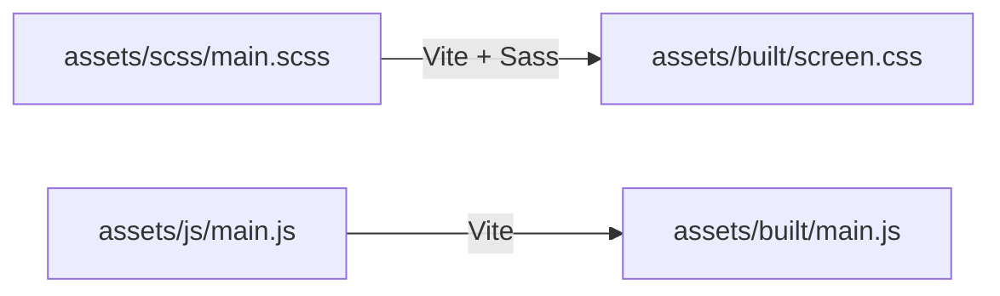

[根目录](../../CLAUDE.md) > **assets**

# assets 模块

> **职责**: 存放主题的所有静态资源，包括 CSS 样式、JavaScript 脚本、SCSS 源文件

---

## 变更记录

| 日期 | 版本 | 变更内容 |
|------|------|----------|
| 2026-03-08 | 1.0.1 | 更新文档，反映当前 SCSS 构建流程 |
| 2026-03-08 | 1.0.0 | 初始文档生成 |

---

## 模块结构

```
assets/
├── scsс/                    # SCSS 源文件（当前主要使用）
│   └── main.scss
├── css/                     # CSS 文件（备用/遗留）
│   ├── base/
│   ├── layout/
│   ├── components/
│   └── main.css
├── js/                      # JavaScript 文件
│   ├── main.js              # 主入口
│   ├── core/                # 核心工具
│   └── modules/             # 功能模块
└── built/                   # 构建输出
    ├── screen.css           # 编译后的 CSS
    └── main.js              # 打包后的 JS
```

---

## 构建流程



---

## 子模块索引

| 子模块 | 路径 | 职责 | 状态 |
|--------|------|------|------|
| **scss** | `/assets/scss/` | SCSS 主样式源文件 | ** actively used** |
| js | `/assets/js/` | JavaScript 模块 | 使用中（简化版） |
| css | `/assets/css/` | CSS 分层架构 | 备用/遗留 |
| built | `/assets/built/` | 构建输出 | 自动生成的产物 |

---

## 入口文件

### 样式入口
- **源文件**: `/assets/scss/main.scss`
- **构建输出**: `/assets/built/screen.css`
- **模板引用**: `{{asset 'built/screen.css'}}`

### JS 入口
- **源文件**: `/assets/js/main.js`
- **构建输出**: `/assets/built/main.js`
- **模板引用**: `{{asset 'built/main.js'}}`

---

## 相关文件

### 子模块文档
- [`/assets/scss/CLAUDE.md`](./scss/CLAUDE.md) - SCSS 主样式
- [`/assets/js/CLAUDE.md`](./js/CLAUDE.md) - JavaScript 模块
- [`/assets/css/CLAUDE.md`](./css/CLAUDE.md) - CSS 架构（备用）

### 构建配置
- `/vite.config.js` - Vite 构建配置
- `/package.json` - npm 脚本和依赖

---

*文档生成时间: 2026-03-08 16:48:37*
