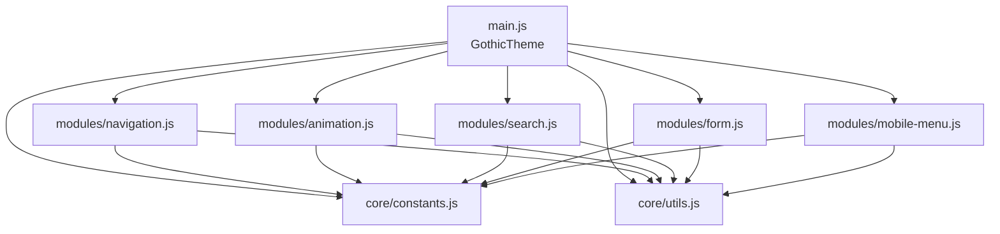

[根目录](../../../CLAUDE.md) > [assets](../) > **js**

# JavaScript 模块

> **职责**: 主题交互逻辑，采用模块化 ES6 架构

---

## 模块结构

```
js/
├── core/                    # 核心层
│   ├── constants.js        # 常量定义
│   └── utils.js            # 工具函数
├── modules/                # 功能模块层
│   ├── navigation.js       # 导航模块
│   ├── animation.js        # 动画模块
│   ├── search.js           # 搜索模块
│   ├── form.js             # 表单模块
│   └── mobile-menu.js      # 移动端菜单
└── main.js                 # 主入口（GothicTheme 类）
```

---

## 架构概览



---

## 入口与启动

### main.js - GothicTheme 类

**职责**: 主题主控制器，管理所有模块的生命周期

**初始化流程**:
```javascript
class GothicTheme {
  constructor() {
    this.modules = {};
    this.initialized = false;
  }

  init() {
    console.log('Initializing Gothic Theme...');

    // 1. 初始化核心模块（必需）
    this.modules.navigation = new Navigation();
    this.modules.navigation.init();

    this.modules.animation = new Animation();
    this.modules.animation.init();

    // 2. 条件初始化（可选）
    if (document.querySelector(SELECTORS.SEARCH_TRIGGER)) {
      this.modules.search = new Search();
      this.modules.search.init();
    }

    if (document.querySelector(SELECTORS.FORM_SUBSCRIBE)) {
      this.modules.form = new Form();
      this.modules.form.init();
    }

    if (isMobile() && document.querySelector(SELECTORS.MENU_TRIGGER)) {
      this.modules.mobileMenu = new MobileMenu();
      this.modules.mobileMenu.init();
    }

    // 3. 设置全局状态
    this.setGlobalState();

    // 4. 绑定全局事件
    this.bindGlobalEvents();

    this.initialized = true;
  }
}

// 自动初始化
const gothicTheme = new GothicTheme();
gothicTheme.init();
window.gothicTheme = gothicTheme;
```

**全局状态设置**:
- 触屏设备: `body.is-touch` / `body.is-pointer`
- 移动设备: `body.is-mobile` / `body.is-desktop`
- 暗色主题: `body.is-dark`

---

## 核心层 (core/)

### constants.js

**导出内容**:
```javascript
export const SELECTORS = {
  NAV_WRAPPER: '.site-header',
  NAV_LINK: '.site-nav a',
  SEARCH_TRIGGER: '#btn-search',
  MENU_TRIGGER: '#btn-menu-toggle',
  POST_CARD: '.post-card',
  FORM_SUBSCRIBE: '.newsletter-form',
  // ...
};

export const CLASSES = {
  ACTIVE: 'active',
  HOVER: 'hover',
  LOADED: 'page-loaded',
  MENU_OPEN: 'menu-open',
  SEARCH_OPEN: 'search-open',
  ANIMATE_IN: 'animate-in',
  // ...
};

export const CONFIG = {
  ANIMATION: {
    PAGE_FADE_DURATION: 320,
    CARD_STAGGER: 60,
    HERO_STAGGER: 100
  },
  THROTTLE: {
    SCROLL: 16,
    RESIZE: 100,
    INPUT: 150
  }
};
```

### utils.js

**工具函数**:
```javascript
// DOM 选择器
export const $ = (selector) => document.querySelector(selector);
export const $$ = (selector) => document.querySelectorAll(selector);

// 防抖
export const debounce = (fn, delay) => { ... };

// 节流
export const throttle = (fn, limit) => { ... };

// 设备检测
export const isMobile = () => window.innerWidth < 768;
export const isTouchDevice = () => 'ontouchstart' in window;

// 通知
export const showNotification = (message, type = 'info') => { ... };
```

---

## 功能模块 (modules/)

### navigation.js

**职责**: 导航链接状态管理

**关键方法**:
- `setActiveLink()` - 根据当前 URL 高亮导航
- `observeUrlChanges()` - SPA 路由变化监听

**事件处理**:
- `mouseenter` / `mouseleave` - hover 状态
- `focus` / `blur` - 键盘导航
- `click` - 点击反馈

### animation.js

**职责**: 页面动效系统

**功能**:
1. **页面加载动画**: Hero 区域淡入 (320ms)
2. **卡片交错动画**: Intersection Observer + 60ms stagger
3. **阅读进度条**: 滚动时实时更新（节流 16ms）

**API**:
```javascript
animation.init();        // 初始化
animation.reinit();      // SPA 导航后重新初始化
animation.destroy();     // 清理
```

### search.js

**职责**: 搜索功能

**功能**:
- 搜索弹窗开关
- 输入防抖 (300ms)
- Ghost API 搜索
- 本地回退搜索

**DOM 元素**:
```javascript
this.trigger = $('#btn-search');
this.panel = $('#search-overlay');
this.input = $('#search-input');
this.results = $('#search-results');
```

### form.js

**职责**: 表单处理（主要是订阅表单）

### mobile-menu.js

**职责**: 移动端汉堡菜单

---

## 对外接口

### 全局访问

```javascript
// 通过 window 访问
window.gothicTheme.init();
window.gothicTheme.reinit();
window.gothicTheme.destroy();

// 获取模块
const nav = window.gothicTheme.getModule('navigation');
const anim = window.gothicTheme.getModule('animation');
```

### 模块 API

| 模块 | 方法 | 说明 |
|------|------|------|
| Navigation | `setActiveLink()` | 更新当前激活链接 |
| Animation | `reinit()` | SPA 后重新初始化动画 |
| Search | `open()` / `close()` | 控制搜索面板 |
| MobileMenu | `open()` / `close()` | 控制移动菜单 |

---

## 性能优化

### 事件节流

```javascript
// 滚动事件节流 16ms (约 60fps)
this._scrollHandler = throttle(() => this.updateProgress(), 16);
window.addEventListener('scroll', this._scrollHandler, { passive: true });

// 输入防抖 300ms
const handleInput = debounce((e) => this.performSearch(e.target.value), 300);
```

### 懒加载

- 图片使用 `loading="lazy"`
- 模块条件加载（只在需要时初始化）

### 优雅降级

- Intersection Observer 不支持时的回退
- Touch 事件检测

---

## 测试与质量

### 单元测试建议

```javascript
// utils.js 测试
assert(debounce(fn, 100) instanceof Function);
assert(isMobile() === (window.innerWidth < 768));

// constants.js 测试
assert(SELECTORS.NAV_WRAPPER === '.site-header');
assert(CONFIG.ANIMATION.CARD_STAGGER === 60);
```

### 集成测试建议

- 模块初始化流程
- 全局状态设置
- 事件绑定和解绑

---

## 变更记录

| 日期 | 版本 | 变更内容 |
|------|------|----------|
| 2026-03-08 | 1.0.0 | 初始文档生成 |

---

## 相关文件

- `/assets/js/main.js` - 主入口
- `/assets/js/core/constants.js` - 常量定义
- `/assets/js/core/utils.js` - 工具函数
- `/assets/js/modules/navigation.js` - 导航模块
- `/assets/js/modules/animation.js` - 动画模块
- `/assets/js/modules/search.js` - 搜索模块
- `/assets/js/modules/form.js` - 表单模块
- `/assets/js/modules/mobile-menu.js` - 移动端菜单

---

*文档生成时间: 2026-03-08 14:02:37*
